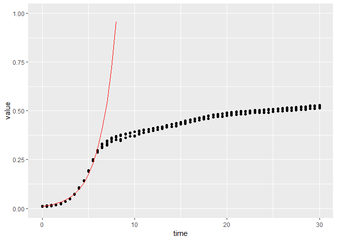
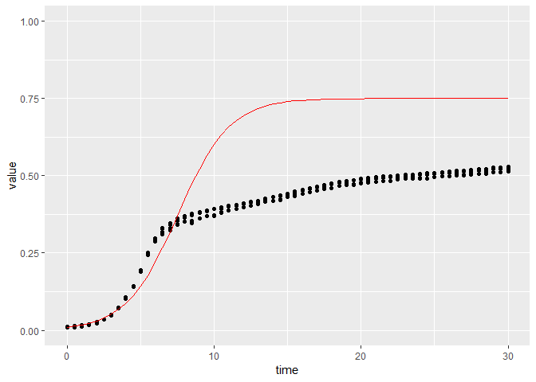

------------------------------------------------------------------------

> ### Learning Objectives
>
> -   Work with growth rate data to explore mathematical growth models.
> -   Manipulate model parameters to build intuition.

As always, you can download [a script with nothing but the R code here](../../scripts/E-02-growth-rate-models.R).
--------------------------------------------------------------------------------------------------------------

Loading the growth rate data
----------------------------

You can remind yourself of these data by reviewing the [previous
exploration](../explorations/E-01-growth-rates). Let's quickly load
these data again.

``` {.r}
library(growthrates)
```

    ## Loading required package: lattice

    ## Loading required package: deSolve

``` {.r}
data(antibiotic)
str(antibiotic)
```

    ## 'data.frame':    2928 obs. of  5 variables:
    ##  $ time    : num  0 0.5 1 1.5 2 2.5 3 3.5 4 4.5 ...
    ##  $ variable: Factor w/ 48 levels "R_R3_0","R_R3_0.002",..: 1 1 1 1 1 1 1 1 1 1 ...
    ##  $ value   : num  0.00881 0.00981 0.01281 0.01781 0.02281 ...
    ##  $ conc    : num  0 0 0 0 0 0 0 0 0 0 ...
    ##  $ repl    : Factor w/ 4 levels "R3","R4","R5",..: 1 1 1 1 1 1 1 1 1 1 ...

Okay, here's the same quick summary of our data that we saw before.
Let's pull up that final plot as well.

``` {.r}
library(ggplot2)
ggplot(antibiotic,aes(x=time,y=value,color=factor(conc)))+geom_point()
```


Wow, these look like some pretty well-behaved data! The replicates at
the same antibiotic concentration are pretty similar to each other,
while bacteria grown at increasing antibiotic concentrations show
decreasing growth rates. Trying to build a model to include time and
antibiotic concentration is a bit above our paygrade right now. Let's
just focus on a single concentration; why not start at 0. The package
**`dplyr`** (contained in **`tidyverse`**) has some nice tools for
quickly filtering data to particular subset. [Reading 3: Using the dplyr
package](../../readings/R-03-dplyr) has a longer walkthrough of the
functions like `filter()` and `mutate()` that we'll be using here.

``` {.r}
library(dplyr)
```

    ## 
    ## Attaching package: 'dplyr'

    ## The following objects are masked from 'package:stats':
    ## 
    ##     filter, lag

    ## The following objects are masked from 'package:base':
    ## 
    ##     intersect, setdiff, setequal, union

``` {.r}
antibiotic_0 <- filter(antibiotic, conc == 0)
ggplot(antibiotic_0,aes(x=time,y=value))+geom_point()
```


Okay, we have a few things to unpack. First, we got a suprise message
when we loaded **`dplyr`**. It mentions some "objects" from other
packages that are now "masked". This is because **`dplyr`** has
functions named `filter`, `lag`, `intersect`, `setdiff`, etc. But
functions with those names already exist in R.\
So, when **`dplyr`** is loaded, it masks the other versions. Thus, when
you call the function `filter()`, it will be the function from the
**`dplyr`** package, not the basic function from the **`stats`**
package. This is usually not a big deal, but it's something to remember
if a function seems to be working oddly.

Second, we didn't define the *color* aesthetic this time. Why not? Well,
because we are only looking at a single concentration level, so we don't
need it.

Comparing with a theoretical model
----------------------------------

Okay, so how do we model this? If you're currently taking BIS 23a or a
similar course, you may have learned about this in lecture. For a
refresher, this [Khan Academy
page](https://www.khanacademy.org/science/biology/ecology/population-growth-and-regulation/a/exponential-logistic-growth)
has a walkthrough about modeling population growth.

The simplest model is often the best. If it fits the data well, then you
can have clear interpretations and predictions. Let's start with basic,
exponential growth and see how it looks. Fundamentally, the exponential
model is based on the assumption that a population's growth rate is
proportional the current population size. In other words, even though
each individual reproduces at a similar rate, on average, larger
populations will produce more offspring. In reality, this is alarming,
because things can spiral to huge numbers very fast! We sometimes think
about this in terms of doubling rates -- if it takes some number *X*
years for the population to double, then another *X* years later it will
have doubled again. For humans, there are many factors that make the
global population growth different from exponential. [Our World in
Data](https://ourworldindata.org/world-population-growth) has a nice
deep dive into human population growth trends.

But for bacteria, particularly at small population sizes, the
exponential model might fit well. In mathematical terms, our assumption
of proportional growth rate can be translated into an equation as
$$\frac{dN}{dt} = rN$$. Here $$N$$ is the population size, $$t$$ is the
time variable, and $$r$$ is a parameter to represent the growth rate.
You can think of $$r$$ as a parameter that represents net growth rate,
incorporating both births and deaths. If a population is decreasing,
it's totally possible that $$r$$ could be negative, when births are
occurring less often than deaths. To put the equation into words, the
change in population size at a particular moment equals the growth rate
$$r$$ times the population size $$N$$.

This is not a course on differential equations. But it turns out that
the solution to this equation is pleasantly simple:
$$N(t) = e^{rt}N_0$$. The population at some time $$t$$ is a function of
$$N_0$$, the intial population at time 0, times $$e^{rt}$$. So $$N(t)$$
is an exponential function of $$t$$, hence we call this the *exponential
model*.

But does it fit our data well? This next step will get you used to the
typical way that we visualize models in R.

Visualizing the exponential model
---------------------------------

To plot the function, we can generate model output by taking a vector of
time points, and applying the function to each one. It feels confusing
at first, but it's surprisingly simple to do.

``` {.r}
r <- 0.57
N0 <- 0.01
antibiotic_0 <- mutate(antibiotic_0, model_output = exp(r*time)*N0)
p <- ggplot(antibiotic_0,aes(x=time,y=value))+geom_point()
p <- p + geom_line(aes(y=model_output), color = "red")
p <- p + ylim(c(0,1))
p
```

    ## Warning: Removed 176 rows containing missing values (geom_path).



The code above might look scary, so let's walk through it. I first
updated the dataframe `antibiotic_0`. The `mutate()` function in
**`dplyr`** allows you to create a new column as a function of other
columns. So I used the `time` column and applied the exponential
function from above. Note I used 0.01 as the $$N_0$$, based on a rough
inspection of the data. And I used $$r = 0.57$$ because I explored and
found that that value of $$r$$ fit the data well for early time steps.

But... this model is definitely not fitting the data at later times.

> ### Challenge -- model parameters
>
> We got the data to fit fairly well at early time steps, but then it
> was way off for later times. Can you find $$r$$ and $$N_0$$ to fit the
> data better? Explore a little bit by changing the value of the
> varaibles $$r$$ and $$N0$$ in the R code above, and re-running the
> plot.
>
> -   I suspect you won't ever find a great fit. Why not?

More complex models
-------------------

Okay, our basic exponential model was not up to the task of explaining
these data. But we do know of another model (also reviewed on the [Khan
page](https://www.khanacademy.org/science/biology/ecology/population-growth-and-regulation/a/exponential-logistic-growth)
) to try. This is called the logistic model. Instead of assuming that
the population will *always* grow at a rate proportional to population
size, we now consider that at some point the population growth may slow
down. There may be constraints on resources like food, water, or space
that prevent never-ending population growth. A first take on this might
start with our similar equation $$\frac{dN}{dt} = rN$$, but add a second
factor that will take the population growth rate $$\frac{dN}{dt}$$
towards 0 as $$N$$ reaches some maximum population size $$K$$. Note: in
ecology this parameter $$K$$ is often called the *carrying capacity*.
Let's try out this updated equation:
$$\frac{dN}{dt} = rN(1-\frac{N}{K})$$. Now when $$N$$ is much smaller
than $$K$$, then our new term is near 1, and we basically have the
familiar exponential growth. But as $$N$$ gets close in value to $$K$$,
then the term $$(1-\frac{N}{K})$$ gets close to 0, and population growth
will slow to a halt.

This is the population *growth* that's slowing. The population won't die
out, it will just level off at a value of $$K$$. Okay, let's plot this.
The solution to this equation is more complicated. Here's one way to
represent the solution.
\begin{equation}
  N(t) = \frac{KN_0}{N_0+(K-N_0e^{-rt}}
\end{equation}
We have three parameters to fit to our data now: the starting population
size $$N_0$$, the carrying capacity $$K$$, and the "growth rate" $$r$$.
I put "growth rate" in quotes, because we know that now the rate slows
as population increases. Some people call $$r$$ the *maximum growth
rate* when they're talking about the logisitic model. This is because
when $$N$$ is very small, the growth will be at its maximum, and will be
approximately exponential with rate $$r$$.

> ### Advanced coding -- defining your own functions
>
> To make it easy for us to try out different values of our three
> parameters, I'm going to define a new function `log_growth`, that
> takes an input `t` and parameters `K`, `r`, and `N0` and returns the
> output `N`, the population size at the input time `t` that was chosen.

``` {.r}
log_growth <- function(t,K,r,N0)
{
    N <- K*N0/(N0+(K-N0)*exp(-r*t))
    return(N)
}
```

You need to run that chunk of code in your R session to load the new
function. In your Global Environment (upper right of R Studio), you can
scroll down to see that there's now a function called `log_growth`. The
reason why we did this will become clear as we try some plotting.

``` {.r}
K <- .75
r <- .57
N0 <- 0.01
antibiotic_0 <- mutate(antibiotic_0, model_logistic_output = log_growth(time,K,r,N0))
p <- ggplot(antibiotic_0,aes(x=time,y=value))+geom_point()
p <- p + geom_line(aes(y=model_logistic_output), color = "red")
p <- p + ylim(c(0,1))
p
```



As always, let's unpack this code a bit. First I just chose some random,
so-so options for `K`, `r`, and `N0`. Well, `N0` is still just the
starting population, so that shouldn't have changed from the previous
model. I used the old `r` as well, although it's clearly not perfect.
*How would you come up with a good `K` to try out?*

Next, I used that `mutate()` function again. This time, I created a new
column in the data called `model_logistic_output`. Instead of having to
write out a whole equation, I used the function we just defined, taking
the inputs as the column `time` from the data, as well as the parameters
we just defined above.

> ### Challenge -- fitting the logistic equation
>
> -   Take some time now to play around with those parameters. Can you
>     come up with a better fit?
> -   It seems clear that we can't quite get this perfect either. Why
>     not? Can you come up with any biological reasons why our logistic
>     model isn't perfect?
>
> [Some potential answers](../answers/E02C1)

<p style="text-align: right; font-size: small;">
Page built on: 2018-09-18 at 15:38:19
</p>

